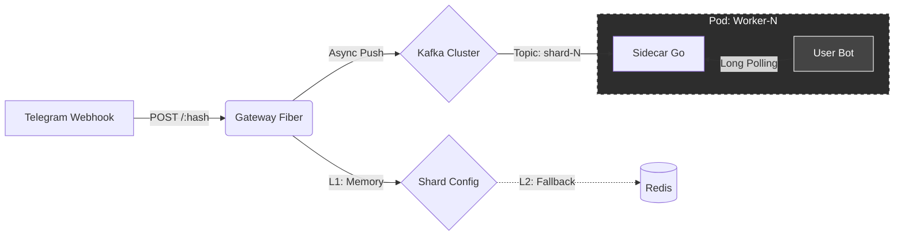

```mermaid
graph LR
    %% Стилизация
    classDef plain fill:#fff,stroke:#333,stroke-width:1px;
    classDef pod fill:#2d2d2d,stroke:#fff,stroke-width:2px,stroke-dasharray: 5 5,color:#fff;
    classDef darkNode fill:#444,stroke:#fff,stroke-width:1px,color:#fff;
    


    %% Основной поток (GW теперь обычный)
    TG[Telegram Webhook] -->|POST /:hash| GW(Gateway Fiber)
    
    %% Кэш и Редис
    GW -->|L1: Memory| CACHE{Shard Config}:::cache
    CACHE -.->|L2: Fallback| REDIS[(Redis)]:::cache

    %% Кафка
    GW -->|Async Push| KAFKA{Kafka Cluster}:::kafka

    %% Воркер (Под)
    subgraph Worker_Pod [Pod: Worker-N]
        direction TB
        %% Определяем узлы
        %% SC теперь использует redNode
        SC[Sidecar Go]
        BOT[User Bot]:::darkNode
        
        %% Хак: Невидимая связь заставляет Бота встать ПОД Сайдкаром
        SC ~~~ BOT
        
        %% Реальная связь (Long Polling)
        BOT -->|Long Polling| SC
    end
    
    %% Применяем стиль к рамке пода
    class Worker_Pod pod

    %% Связь Кафки с сайдкаром
    KAFKA -->|Topic: shard-N| SC
```
