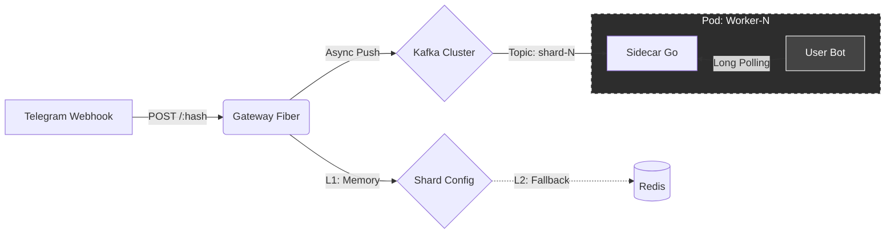

# ⚡ TG-Serverless Platform

**Next-Gen Serverless Infrastructure for Telegram Bots**

  <b>TG-Serverless</b> — это облачная PaaS платформа, позволяющая разворачивать, масштабировать и мониторить тысячи Telegram-ботов с единой точки входа.
   
  Мы решаем проблему "шумных соседей", бесконечных ретраев и потери вебхуков.

---

## 🏗 Архитектура

Наша платформа построена на принципах **Event-Driven Architecture** и **Hard Multi-tenancy**. Мы отказались от синхронной обработки в пользу асинхронной очереди с гарантиями доставки.

---

## 🛠 Технологический стек

Мы используем современные инструменты для обеспечения надежности и производительности:

| Компонент | Технологии | Назначение |
| :--- | :--- | :--- |
| **Ingress** | `Go`, `Fiber`, `Sarama` | **Gateway Service.** Прием вебхуков (10k+ RPS), валидация и шардирование в Kafka. Zero-Allocation. |
| **Compute** | `Go`, `Franz-Go`, `Python` | **Sidecar Proxy.** Адаптер между Kafka и кодом пользователя. Реализует Backpressure и Long Polling API. |
| **Bus** | `Apache Kafka`, `KRaft` | Надежная шина событий. Гарантирует, что ни одно сообщение от Telegram не потеряется. |
| **Orchestration** | `K8s`, `KEDA`, `cdk8s` | Автомасштабирование (Scale-to-Zero) на основе лага очереди. Infrastructure as Code на Go. |
| **Storage** | `Redis`, `ClickHouse` | L2-кэширование конфигураций и аналитика реального времени (Vector pipeline). |

---

## 💎 Ключевые компоненты

### 🛡️ [Gateway Service](https://github.com/tg-serverless/tg-gateway)
Единая точка входа. Реализует паттерн **Fire-and-Forget**.
*   **Smart Sharding:** Детерминированное распределение сообщений по шардам на основе `user_id` для сохранения порядка.
*   **Resilience:** Защита от *Cache Stampede* (Singleflight) и падения брокеров.

### 🏎️ [Sidecar Proxy](https://github.com/tg-serverless/worker-sidecar)
Интеллектуальный "сосед" для контейнера бота.
*   **Protocol Translation:** Превращает Push-поток Kafka в Pull-интерфейс, совместимый с библиотеками (`aiogram`, `telebot`).
*   **Safety:** Изолирует бота от интернета, предоставляя контролируемый прокси для исходящих запросов.

### 🧠 [Control Plane]() (Coming Soon)
API управления платформой.

---

### 🤝 Join the Development

Мы строим Open Source компоненты для High Load систем.
**[Связаться с Lead Architect](https://t.me/chebnick)**

---

### 💎 Support Architecture & Development

Building High Load infrastructure requires coffee and cloud credits.
If you like this project, you can support us via **TON**:

`UQB05cLbbMiz0MX_2ETU6M-tT3tx5VedP7mPqFFfx5d_EMdN`

